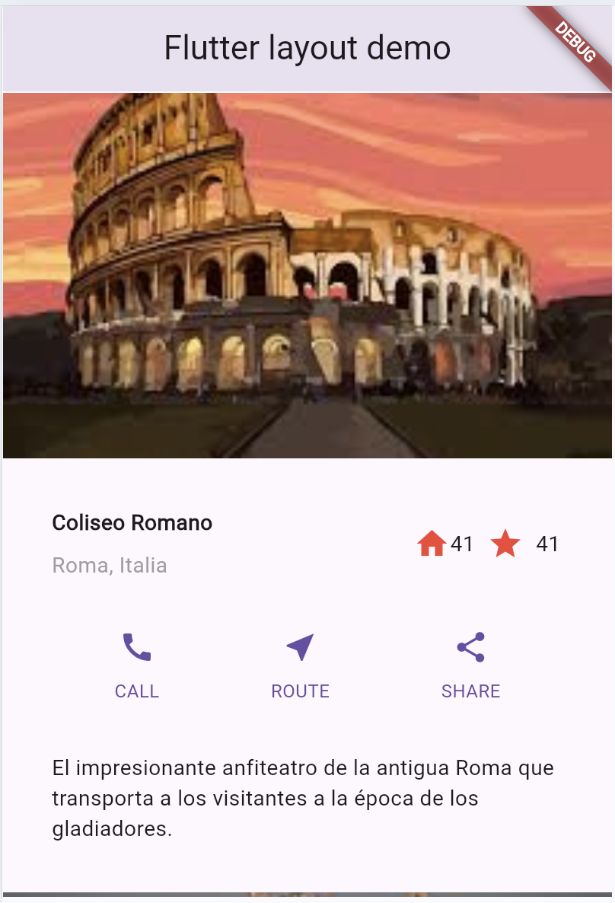
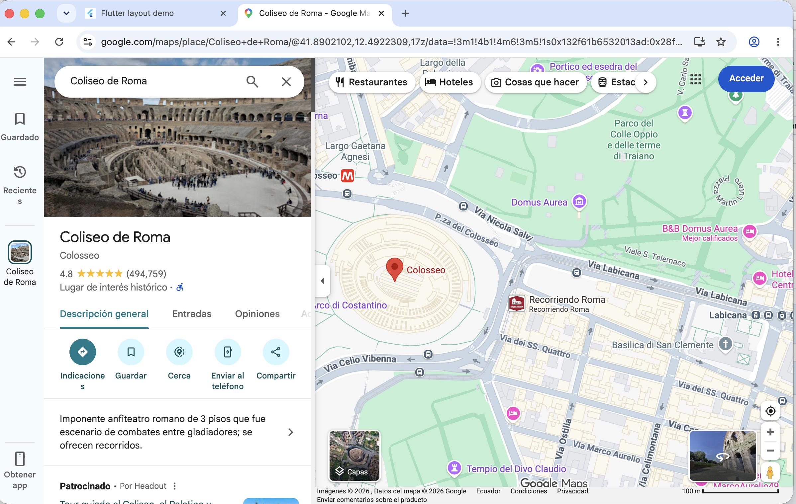

# 🌍 Flutter Tourist Places App

Aplicación móvil desarrollada en Flutter que presenta una colección de destinos turísticos internacionales mediante una interfaz visual basada en widgets. Cada lugar incluye una imagen representativa, ubicación, descripción, sistema de favoritos y acceso directo a Google Maps para consultar su ubicación.

## 📱 Características

* Visualización de múltiples sitios turísticos.
* Imágenes locales almacenadas en la aplicación.
* Información descriptiva de cada destino.
* Sistema interactivo de favoritos mediante StatefulWidget.
* Enlaces directos a Google Maps.
* Diseño responsivo utilizando widgets de Flutter.
* Navegación vertical mediante SingleChildScrollView.

## 🏞️ Lugares turísticos incluidos

* Oeschinen Lake Campground (Suiza)
* Torre Eiffel (Francia)
* Coliseo Romano (Italia)
* Basílica de la Sagrada Familia (España)
* Museo del Louvre (Francia)
* Acrópolis (Grecia)
* Big Ben y Parlamento (Reino Unido)
* Basílica de San Pedro (Ciudad del Vaticano)
* Lago Bled (Eslovenia)
* Laguna Azul (Malta)

## 🛠️ Tecnologías utilizadas

* Flutter
* Dart
* Material Design
* url_launcher

## 📂 Estructura del proyecto
``` bash
lib/
 └── main.dart

images/
 ├── A1.jpeg
 ├── Torre.jpeg
 ├── coliseo.jpeg
 ├── basilica.jpeg
 ├── museo.jpeg
 ├── acropolis.jpeg
 ├── bigben.jpeg
 ├── basilica1.jpeg
 ├── lagobled.jpeg
 └── laguna.jpeg
```

## 📦 Dependencias

Agregar en pubspec.yaml:
``` bash 
dependencies:
  flutter:
    sdk: flutter
  url_launcher: ^6.3.0
```

## 🚀 Instalación y ejecución

#### 1. Clonar el repositorio:

``` bash 
git clone https://github.com/WilmerRamos21/Flutter-Tourist-Places-App.git
```

#### 2. Ingresar al directorio:
``` bash 
cd repositorio
```

#### 3. Instalar dependencias:

``` bash 
flutter pub get
```

#### 4. Ejecutar la aplicación:

``` bash 
flutter run
```

## 📸 Capturas de pantalla

Agregar las capturas dentro de una carpeta llamada screenshots en la raíz del proyecto.

### Pantalla principal


### Google Maps


## 🎯 Objetivos de aprendizaje

Este proyecto permitió practicar:

* Uso de StatelessWidget y StatefulWidget.
* Manejo de layouts con Row, Column y Expanded.
* Gestión de estados con setState().
* Carga de imágenes locales.
* Integración con aplicaciones externas mediante URL Launcher.
* Diseño de interfaces con Material Design.

## 👨‍💻 Autor

Adrián Ramos

Proyecto académico desarrollado con Flutter y Da
